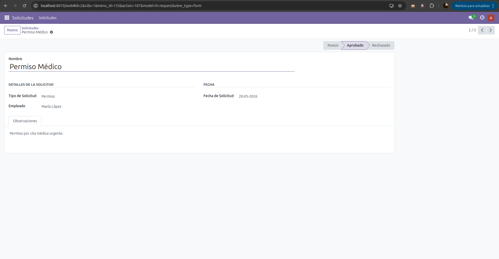
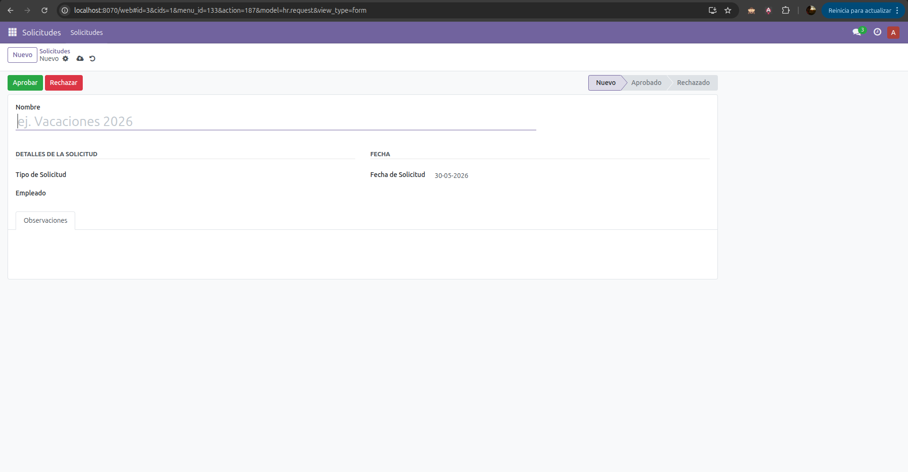
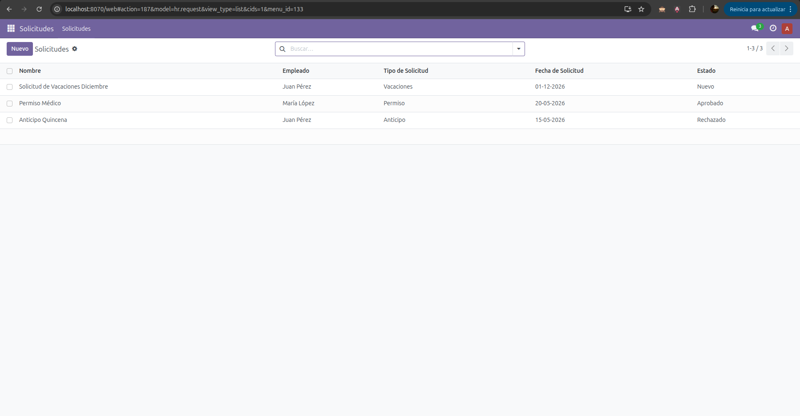

# 📋 Módulo HR Request - Odoo v17

## 📝 Descripción

Módulo personalizado desarrollado para **Odoo v17 Community Edition** que implementa un sistema completo de gestión de solicitudes de recursos humanos. El módulo incluye el modelo `hr.request` con campos personalizados, vistas intuitivas, lógica de botones y control de permisos granular.

---

## 🎯 Características Principales

- ✅ Modelo `hr.request` completamente funcional
- ✅ Vistas lista, formulario y búsqueda
- ✅ Flujo de aprobación con cambios de estado
- ✅ Control de acceso basado en roles
- ✅ Campos personalizados para solicitudes de RRHH

---

## 🚀 Guía de Instalación

### Requisitos Previos

- **Docker** (Opción 1) o **Odoo v17 instalado localmente** (Opción 2)
- **Git** (para clonar repositorios)
- Puerto **8069** disponible (Odoo por defecto)

### Opción 1: Instalación con Docker _(Recomendado)_

```bash
# Clonar el repositorio
git clone <tu-repositorio>
cd modulo1_odoo

# Levantrar los contenedores
docker-compose up -d

# Acceder a Odoo en http://localhost:8069
```

El archivo `docker-compose.yml` está preconfigurado con volúmenes que apuntan a la ubicación actual del módulo, permitiendo desarrollo en vivo.

### Opción 2: Instalación Local sin Docker

1. **Descargar e instalar Odoo v17**

    ```bash
    git clone https://github.com/odoo/odoo.git --branch 17.0
    ```

2. **Copiar el módulo**

    ```bash
    cp -r hr_request /ruta/a/odoo/addons/
    ```

3. **Instalar dependencias**

    ```bash
    cd /ruta/a/odoo
    pip install -r requirements.txt
    ```

4. **Iniciar Odoo y activar el módulo**
    ```bash
    ./odoo-bin -d nombre_base_datos --addons-path=addons,extra_addons
    ```

---

## 📂 Estructura del Módulo

```
hr_request/
├── __init__.py                    # Inicializador del módulo
├── __manifest__.py                # Metadatos y dependencias
├── models/
│   ├── __init__.py
│   └── hr_request.py              # Definición del modelo principal
├── views/
│   └── hr_request_views.xml       # Vistas (lista, formulario, búsqueda)
├── security/
│   ├── ir.model.access.csv        # Control de acceso por rol
│   └── record_rules.xml           # Reglas de nivel de registro
└── data/
    ├── hr_employee_data.xml       # Datos iniciales de empleados
    └── hr_request_data.xml        # Datos de ejemplo de solicitudes
```

---

## 🔧 Configuración

### Acceso y Permisos

Los permisos se controlan mediante:

- **`ir.model.access.csv`** — Permisos globales por rol (crear, leer, escribir, eliminar)
- **`record_rules.xml`** — Reglas a nivel de registro para filtrado automático

### Variables de Entorno (Docker)

Editar `docker-compose.yml` para personalizar:

```yaml
environment:
    - POSTGRES_USER=odoo
    - POSTGRES_PASSWORD=contraseña
    - ODOO_ADMIN_PASSWORD=admin
```

---

## 🎬 Uso Básico

### Crear una Solicitud

1. Ir a la sección **Recursos Humanos**
2. Seleccionar **Solicitudes**
3. Hacer clic en **Crear**
4. Rellenar los campos requeridos
5. Guardar y enviar para aprobación

### Estados de la Solicitud

| Estado        | Descripción              |
| ------------- | ------------------------ |
| **Borrador**  | Creada pero no enviada   |
| **Enviada**   | Esperando aprobación     |
| **Aprobada**  | Aceptada por el gestor   |
| **Rechazada** | Denegada por el gestor   |
| **Cancelada** | Cancelada por el usuario |

---

## 📸 Evidencia de Funcionamiento

### Interfaz Principal



### Formulario de Detalle



### Lista de Solicitudes Filtradas



---
